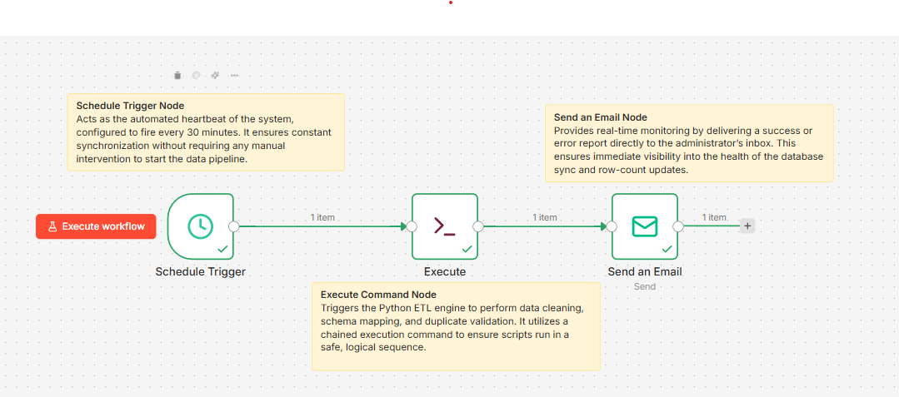

# 📘 User Guide: HealthSync Automated Pipeline
### *Standard Operating Procedures for Healthcare Data Automation*

---

**This guide provides the necessary steps to deploy, manage, and monitor the HealthSync ETL pipeline. It is designed for system administrators and data engineers to ensure 100% uptime of healthcare data synchronization.**

## 📑 Table of Contents
1. [Environment Preparation](#-1-environment-preparation)
2. [Workflow Architecture](#-2-workflow-architecture)
3. [Deployment Steps](#-3-deployment-steps)
4. [Monitoring & Reporting](#-4-monitoring--reporting)
5. [Troubleshooting & Maintenance](#-5-troubleshooting--maintenance)

---

## 🛠 1. Environment Preparation

### **Software Requirements**
To ensure the pipeline runs successfully, the following environment must be configured:
* **n8n Desktop/CLI**: The primary orchestration engine.
* **MySQL Workbench**: The target storage for all processed healthcare records.
* **Python 3.x Environment**: Required for executing the data transformation logic.
* **SMTP Server**: Required for the automated email notification system.

### **Database Initialization**
* Ensure a schema named `my_new_data` is created in your MySQL instance.
* The system will automatically generate tables based on the processed filenames.

---

## 🏗 2. Workflow Architecture

The HealthSync pipeline operates on a **Linear Trigger-Action** model:

1.  **The Heartbeat (Schedule)**: A trigger node that initiates the process every 30 minutes.
2.  **The Engine (Execute)**: A command node that launches the data processing scripts in a specific sequence.
3.  **The Courier (SMTP)**: A notification node that delivers a status report to the administrator's inbox upon completion.

---

## 🚀 3. Deployment Steps

### **Step A: Launching the n8n Server**
* Open the Command Prompt (CMD).
* Execute the startup command to bypass node restrictions and launch the local environment.
* **Note**: Keep this window active; closing it will stop the automation.

### **Step B: Importing the Workflow**
* Access the n8n Editor via your browser (usually `localhost:5678`).
* Import the provided `.json` workflow file.
* Update the file paths in the **Execute Command** node to match your local directory structure.

### **Step C: Activation**
* Click the **Publish** button in the top-right corner.
* Verify the status toggle is set to **Active**.

---

## 📊 4. Monitoring & Reporting

### **Automated Email Reports**
After every execution cycle, the system sends an automated email. This report includes:
* **Success Status**: Confirmation that data was pushed to MySQL.
* **Row Count**: The exact number of new, unique records added.
* **Error Alerts**: High-priority notifications if a file is missing or a path is unreachable.

### **Execution Logs**
To audit past performance:
* Navigate to the **Executions** tab in n8n.
* Review the timestamped history for any "Failed" status indicators.

---

## ⚠️ 5. Troubleshooting & Maintenance

| Common Issue | Operational Cause | Resolution |
| :--- | :--- | :--- |
| **Connection Timeout** | MySQL Service is stopped. | Start MySQL via Windows Services or Workbench. |
| **Port 5678 Blocked** | A previous n8n session is stuck. | Use the `taskkill` command in CMD to reset the process. |
| **Data Mismatch** | Source file headers do not match. | Ensure columns like `patient_mrn` follow the standard template. |
| **Notification Failure** | SMTP security block. | Verify Google App Password or SMTP credentials. |

---

### 🛡️ Data Integrity Guarantee
*This pipeline utilizes **Idempotency Logic**, ensuring that no duplicate records are ever inserted into the production database, even in the event of multiple manual triggers.*

---

**Developed by Nandini Bhalekar** *Data Science Internship Milestone - 2026*

## 🖼️ Visual Workflow Representation
Below is the architectural layout of the automated ETL pipeline as configured in n8n:

  
  
<i>Figure 1: Automated sequence featuring Schedule Trigger, Python Execution, and SMTP Notification nodes.</i>

## 📊 Proof of End-to-End Automation
### *Continuous Monitoring and Data Sync Validation*

 

The system has been meticulously validated to ensure that the synchronization schedule is operating as intended. Below is evidence of the pipeline's operational resilience, demonstrating three consecutive execution cycles, exactly **30 minutes apart**.

 

 

